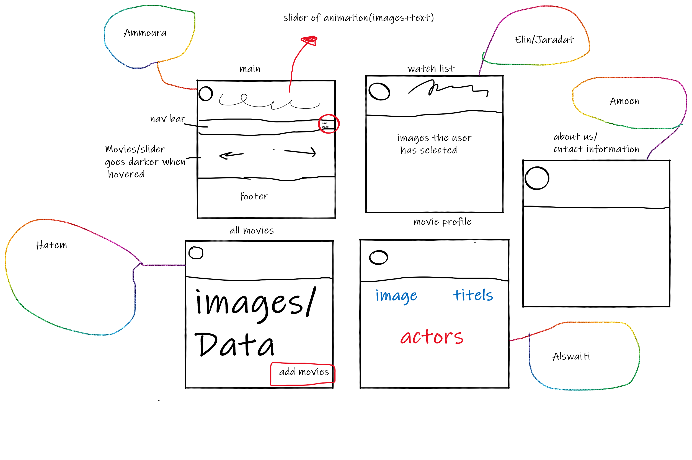

# moviezella

## Vision 
At **Moviezella**, we want to entertain the world. Whatever your taste, and no matter where you live, we give you access to best-in-class movies. Our members control what they want to watch, when they want it, with no ads, in one simple subscription. We’re streaming in more than 30 languages and 190 countries, because great stories can come from anywhere and be loved everywhere. We are the world’s biggest fans of entertainment, and we’re always looking to help you find your next favorite story.

## Site Structure

>Our site will contain 5 pages, that are interconnected with each other.

### Home Page

>This is our main page, where wo will display our logo, site name with some interesting sayings, navigation bar (home, all movies, etc), s slide with our favorite movies and out footer

### All Movies

>In this page we will include all of our movies with pictures and some informations related to ech movie, with a certain style and order. Also, this page will allow the user to add movies to our site, select movies to watch later and other options.

### Watch List

>This page will display the users movies previously selected. Other interactive options might be there too.

### Movie Profile

>This page can be entered through **All Movies** page. In it will be specific details about a certain movie (actors, producer, production, dates, erc).

### About Us
>In the end, the **about us** page will display a message from our team with our profiles and links.

### Low fidelity Wireframe

  